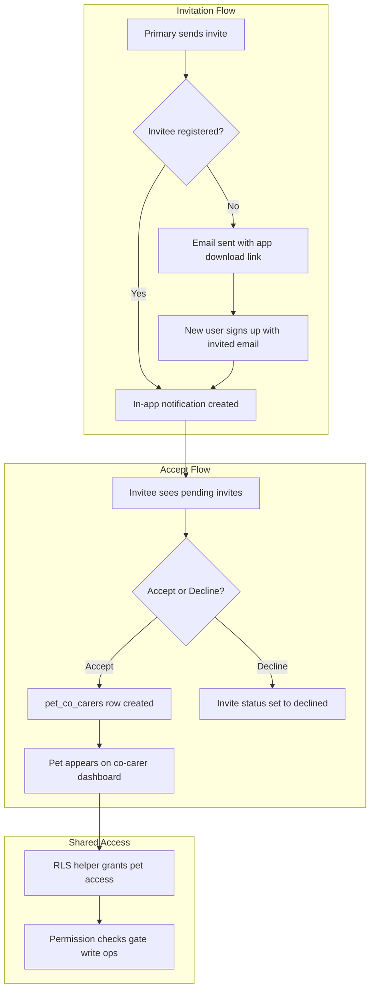

# Co-Care Feature Implementation Plan

## Current State

The app is **owner-centric**: every table's RLS checks `pets.owner_id = auth.uid()`, every query filters by `owner_id`, and the onboarding flow requires at least one *owned* pet. There is scaffolding already in place:

- A `co_carer_invites` table exists (schema in [001_initial_schema.sql](supabase/migrations/001_initial_schema.sql)) with columns `pet_id`, `invited_by`, `email`, `status` (`pending`/`accepted`/`declined`)
- A `CoCarerInvite` type exists in [types/database.ts](types/database.ts)
- The [invite-care.tsx](app/(logged-in)/pet/[id]/invite-care.tsx) screen is a placeholder with "Coming soon" alert
- `PetFormData` already has a `coCarerEmail` field, and [services/pets.ts](services/pets.ts) inserts into `co_carer_invites` during `createPet`
- The dashboard bell button (`onNotificationsPress`) is wired to a no-op

None of these are functional. No notification system, no shared access, no RLS for co-carers.

---

## Architecture Overview




---

## Phase 1: Database Schema and RLS

### 1A. New `pet_co_carers` junction table

This is the core relationship table. When an invite is accepted, a row is created here. The invite table handles the *invitation lifecycle*; this table handles the *active relationship*.

```sql
CREATE TABLE public.pet_co_carers (
  id uuid DEFAULT gen_random_uuid() PRIMARY KEY,
  pet_id uuid REFERENCES public.pets(id) ON DELETE CASCADE NOT NULL,
  user_id uuid REFERENCES public.profiles(id) ON DELETE CASCADE NOT NULL,
  invited_by uuid REFERENCES public.profiles(id) ON DELETE SET NULL,
  permissions jsonb NOT NULL DEFAULT '{
    "can_log_activities": true,
    "can_edit_pet_profile": false,
    "can_manage_food": false,
    "can_manage_medications": false,
    "can_manage_vaccinations": false,
    "can_manage_vet_visits": false
  }'::jsonb,
  created_at timestamptz NOT NULL DEFAULT now(),
  UNIQUE(pet_id, user_id)
);
```

**Permission keys** (all booleans, default to a sensible "log-only" baseline the primary can expand):


| Key                       | Controls                                                 |
| ------------------------- | -------------------------------------------------------- |
| `can_log_activities`      | Log exercise, food, medication, vet visit activities     |
| `can_edit_pet_profile`    | Edit name, breed, details, avatar, exercise requirements |
| `can_manage_food`         | Add/edit/delete pet food entries                         |
| `can_manage_medications`  | Add/edit/delete medications                              |
| `can_manage_vaccinations` | Add/edit/delete vaccinations                             |
| `can_manage_vet_visits`   | Create/edit/delete scheduled vet visits                  |


Viewing is always allowed (a co-carer can always see the pet's full profile and records). The toggles control *write* operations.

### 1B. Extend `co_carer_invites`

Add columns to support the full invite flow:

```sql
ALTER TABLE public.co_carer_invites
  ADD COLUMN invited_user_id uuid REFERENCES public.profiles(id) ON DELETE SET NULL,
  ADD COLUMN responded_at timestamptz;
```

`invited_user_id` is populated when the invite is created for a registered user, or backfilled when a new user signs up with a matching email. This avoids relying solely on email matching at query time.

### 1C. `notifications` table

```sql
CREATE TABLE public.notifications (
  id uuid DEFAULT gen_random_uuid() PRIMARY KEY,
  user_id uuid REFERENCES public.profiles(id) ON DELETE CASCADE NOT NULL,
  type text NOT NULL,          -- 'co_care_invite', 'co_care_accepted', 'co_care_removed'
  title text NOT NULL,
  body text,
  data jsonb DEFAULT '{}',     -- e.g. { "pet_id": "...", "invite_id": "..." }
  read boolean NOT NULL DEFAULT false,
  created_at timestamptz NOT NULL DEFAULT now()
);
```

### 1D. RLS helper function + policy overhaul

Create a reusable SQL function:

```sql
CREATE OR REPLACE FUNCTION public.can_access_pet(p_pet_id uuid)
RETURNS boolean AS $$
  SELECT EXISTS (
    SELECT 1 FROM public.pets WHERE id = p_pet_id AND owner_id = auth.uid()
  ) OR EXISTS (
    SELECT 1 FROM public.pet_co_carers WHERE pet_id = p_pet_id AND user_id = auth.uid()
  );
$$ LANGUAGE sql SECURITY DEFINER STABLE;
```

Then a permission-aware variant for write operations:

```sql
CREATE OR REPLACE FUNCTION public.has_pet_permission(p_pet_id uuid, p_permission text)
RETURNS boolean AS $$
  SELECT EXISTS (
    SELECT 1 FROM public.pets WHERE id = p_pet_id AND owner_id = auth.uid()
  ) OR EXISTS (
    SELECT 1 FROM public.pet_co_carers
    WHERE pet_id = p_pet_id
      AND user_id = auth.uid()
      AND (permissions->>p_permission)::boolean = true
  );
$$ LANGUAGE sql SECURITY DEFINER STABLE;
```

**Every existing RLS policy** across these tables needs updating (all currently use `pets.owner_id = auth.uid()`):

- `pets` (SELECT only -- co-carers can view but not update/delete the pet row directly)
- `pet_foods`, `pet_medications`, `pet_vaccinations`, `pet_vet_visits`, `pet_weight_entries`, `pet_exercises` (SELECT uses `can_access_pet`; INSERT/UPDATE/DELETE use `has_pet_permission` with the relevant key)
- `pet_activities` (SELECT uses `can_access_pet`; INSERT uses `has_pet_permission('can_log_activities')`; UPDATE/DELETE: owner always, co-carer only their own entries)

New RLS for `pet_co_carers`:

- Owners of the pet can SELECT/INSERT/UPDATE/DELETE co-carer rows
- Co-carers can SELECT their own rows (to know their permissions)
- Co-carers can DELETE their own row (leave co-care)

New RLS for `notifications`:

- Users can SELECT/UPDATE their own notifications

New RLS for `co_carer_invites`:

- Extend existing SELECT to also allow `invited_user_id = auth.uid()` (so invitees can see their pending invites)

---

## Phase 2: Backend Services (Supabase Edge Functions)

### 2A. Invite service (`services/coCare.ts`)

New service file with functions:

- `sendCoCareInvite(petId, inviterUserId, email)` -- creates invite row, checks if email belongs to a registered user, creates a notification if so
- `fetchPendingInvitesForUser(userId)` -- returns pending invites where `invited_user_id = userId` OR email matches
- `acceptInvite(inviteId, userId)` -- sets status to `accepted`, creates `pet_co_carers` row with default permissions, creates notification for the inviter
- `declineInvite(inviteId, userId)` -- sets status to `declined`
- `removeCoCarer(petId, coCarerUserId)` -- deletes from `pet_co_carers`, creates notification
- `leaveCoCare(petId, userId)` -- co-carer removes themselves
- `updateCoCarerPermissions(petId, coCarerUserId, permissions)` -- owner updates permissions JSONB
- `fetchCoCarersForPet(petId)` -- returns co-carers with their profiles and permissions
- `fetchUserPermissionsForPet(petId, userId)` -- returns the permission object (or full access if owner)

### 2B. Notification service (`services/notifications.ts`)

- `fetchUnreadNotifications(userId)`
- `markNotificationRead(notificationId)`
- `markAllNotificationsRead(userId)`
- `fetchNotificationCount(userId)`

### 2C. Email Edge Function

A Supabase Edge Function (`supabase/functions/send-co-care-invite/`) that:

- Is triggered when an invite is created for a non-registered email
- Sends a styled email via Resend/SendGrid: "**[Name] wants you to co-care for [Pet Name] on Crittr!**" with app store download links
- This can be triggered from the client via `supabase.functions.invoke()` or via a database trigger on `co_carer_invites` insert

### 2D. Backfill trigger

A Postgres trigger on `profiles` insert (new user signup) that checks `co_carer_invites` for matching email and populates `invited_user_id`:

```sql
CREATE OR REPLACE FUNCTION public.backfill_co_carer_invites()
RETURNS trigger AS $$
BEGIN
  UPDATE public.co_carer_invites
  SET invited_user_id = NEW.id
  WHERE lower(email) = lower((SELECT email FROM auth.users WHERE id = NEW.id))
    AND status = 'pending'
    AND invited_user_id IS NULL;
  RETURN NEW;
END;
$$ LANGUAGE plpgsql SECURITY DEFINER;

CREATE TRIGGER on_profile_created_backfill_invites
  AFTER INSERT ON public.profiles
  FOR EACH ROW EXECUTE FUNCTION public.backfill_co_carer_invites();
```

---

## Phase 3: Client Data Layer

### 3A. Update `fetchUserPets` in [services/pets.ts](services/pets.ts)

Currently:

```typescript
const { data, error } = await supabase
  .from("pets")
  .select("*")
  .eq("owner_id", ownerId)
  .order("created_at", { ascending: true });
```

Change to fetch both owned and co-cared pets. Best approach: an RPC that returns pets with a `role` field, or two parallel queries merged client-side:

```typescript
export async function fetchAccessiblePets(
  userId: string,
): Promise<(Pet & { role: "owner" | "co_carer" })[]> {
  const [owned, shared] = await Promise.all([
    supabase
      .from("pets")
      .select("*")
      .eq("owner_id", userId)
      .order("created_at"),
    supabase
      .from("pet_co_carers")
      .select("pet_id, pets(*)")
      .eq("user_id", userId),
  ]);
  // merge and tag with role
}
```

### 3B. New types in [types/database.ts](types/database.ts)

```typescript
export type CoCarePermissions = {
  can_log_activities: boolean;
  can_edit_pet_profile: boolean;
  can_manage_food: boolean;
  can_manage_medications: boolean;
  can_manage_vaccinations: boolean;
  can_manage_vet_visits: boolean;
};

export type PetCoCarer = {
  id: string;
  pet_id: string;
  user_id: string;
  invited_by: string | null;
  permissions: CoCarePermissions;
  created_at: string;
};

export type PetWithRole = Pet & {
  role: "owner" | "co_carer";
  permissions?: CoCarePermissions;
};

export type Notification = {
  id: string;
  user_id: string;
  type: string;
  title: string;
  body: string | null;
  data: Record<string, unknown>;
  read: boolean;
  created_at: string;
};
```

### 3C. New hooks

- `hooks/queries/useCoCareQuery.ts` -- `useCoCarersForPet(petId)`, `usePendingInvitesQuery(userId)`
- `hooks/queries/useNotificationsQuery.ts` -- `useUnreadNotificationsQuery(userId)`, `useNotificationCountQuery(userId)`
- `hooks/mutations/useCoCareMutations.ts` -- `useSendInviteMutation`, `useAcceptInviteMutation`, `useDeclineInviteMutation`, `useRemoveCoCarerMutation`, `useUpdatePermissionsMutation`
- `hooks/mutations/useNotificationMutations.ts` -- `useMarkReadMutation`

### 3D. Permission-aware hook

A `useCanPerformAction(petId, permission)` hook that:

- Returns `true` if user is the owner
- Returns the specific permission boolean if user is a co-carer
- Used by mutation hooks and UI to conditionally enable/disable actions

### 3E. Update [stores/authStore.ts](stores/authStore.ts)

In `resolveSession`, the pet count check currently uses `.eq("owner_id", userId)`. This needs to also count co-cared pets (via `pet_co_carers`) so that a co-carer who has no owned pets but has accepted an invite is not stuck in onboarding.

Also add `pendingInviteCount` to auth state for onboarding flow awareness.

---

## Phase 4: Onboarding Flow Changes

### 4A. Add a "Pending Invites" check step

Modify [stores/onboardingStore.ts](stores/onboardingStore.ts) and [app/(auth)/(onboarding)/index.tsx](app/(auth)/(onboarding)/index.tsx):

After the **profile** step and before the **pet-type** step, if the user has pending invites:

1. Show a new `PendingInvitesStep` component
2. List pending invites with pet name, inviter name, and Accept/Decline buttons
3. If user accepts at least one invite, they now "have a pet" -- skip to **finish** step
4. If they decline all or tap "Skip, I'll add my own pet", proceed to **pet-type** as normal
5. If no pending invites exist, skip this step entirely (transparent to users with no invites)

Update `ONBOARDING_STEPS` to include the new step conditionally, or handle it as a conditional redirect within the existing step flow.

### 4B. Update `resolveSession` logic

In [stores/authStore.ts](stores/authStore.ts), when checking if the user has pets, also check `pet_co_carers`:

```typescript
const [profileRes, petsCountRes, coCarePetsCount] = await Promise.all([
  supabase.from("profiles").select("*").eq("id", userId).maybeSingle(),
  supabase
    .from("pets")
    .select("*", { count: "exact", head: true })
    .eq("owner_id", userId),
  supabase
    .from("pet_co_carers")
    .select("*", { count: "exact", head: true })
    .eq("user_id", userId),
]);
const hasPets = (petsCountRes.count ?? 0) + (coCarePetsCount.count ?? 0) > 0;
```

Also check for pending invites to decide whether to route to the pending-invites onboarding step vs pet-type step.

---

## Phase 5: UI Screens

### 5A. Revamp invite screen ([app/(logged-in)/pet/[id]/invite-care.tsx](app/(logged-in)/pet/[id]/invite-care.tsx))

Replace the placeholder with a functional screen:

- Email input + "Send Invite" button (wires to `useSendInviteMutation`)
- Below: list of current co-carers for this pet (from `useCoCarersForPet`)
- Each co-carer row: avatar, name, role badge, tap to manage permissions
- Pending invites shown with "Pending" badge and option to revoke

### 5B. New: Permissions management screen (`app/(logged-in)/pet/[id]/co-carer-permissions.tsx`)

- Accessed by tapping a co-carer on the invite screen
- Shows the co-carer's name/avatar
- Toggle switches for each permission
- Save button calls `useUpdatePermissionsMutation`
- "Remove co-carer" destructive action at bottom

### 5C. New: Notifications screen (`app/(logged-in)/notifications.tsx`)

- Accessed from the bell icon in `DashboardHeader` (replace the no-op)
- List of notifications, grouped by date
- Co-care invite notifications have Accept/Decline action buttons inline
- Other notification types show info with tap-to-navigate

### 5D. New: Pending invites onboarding step (`components/onboarding/PendingInvitesStep.tsx`)

- Card for each pending invite: pet avatar/name, inviter name, "Accept"/"Decline" buttons
- "Skip" link to proceed to add-pet flow
- Accepting creates the co-care relationship and advances onboarding

### 5E. Update pet profile and dashboard for co-carer context

- [Pet detail page](app/(logged-in)/pet/[id].tsx): Show a "Co-carer" badge/banner when viewing a pet you don't own. Conditionally hide edit buttons based on permissions. Show co-carers section (who else cares for this pet).
- [Dashboard](app/(logged-in)/dashboard.tsx): Shared pets appear alongside owned pets in the pill switcher and pet management section, with a subtle visual distinction (e.g., a small shared icon overlay).
- [PetManagement.tsx](components/ui/dashboard/PetManagement.tsx): Section label could become "My pets" for owned + "Shared with me" for co-cared, or a unified list with role badges.
- [PetFeatureCard.tsx](components/ui/pets/PetFeatureCard.tsx): Add a co-care indicator badge.

### 5F. Permission-gated UI

Throughout the app, wrap write actions in permission checks:

- Activity logging: check `can_log_activities` before allowing submit
- Pet profile edit buttons: check `can_edit_pet_profile`
- Food/medication/vaccination/vet-visit CRUD: check respective permissions
- Use the `useCanPerformAction` hook to conditionally render or disable buttons
- Show a tooltip or message when a co-carer taps a disabled action: "Contact [Owner Name] to update this permission"

---

## Phase 6: Email Invite for Non-Registered Users

### 6A. Supabase Edge Function

Create `supabase/functions/send-co-care-invite/index.ts`:

- Receives `{ inviterName, petName, inviteeEmail }`
- Uses Resend SDK (or Supabase's built-in SMTP) to send a styled HTML email
- Email body: "[Name] invited you to co-care for [Pet] on Crittr! Download the app to get started." + App Store / Play Store links
- The invite row already exists in `co_carer_invites` before this function is called

### 6B. Client trigger

In `sendCoCareInvite` service function:

- After inserting the invite row, check if the invitee email matches a registered user
- If yes: create an in-app notification, set `invited_user_id`
- If no: call `supabase.functions.invoke('send-co-care-invite', { body: {...} })`

---

## UX Recommendation: Handling Unregistered Invitees

Rather than a separate flow, the cleanest UX is:

1. **Inviter sends invite** -- same UI whether the invitee is registered or not. They just enter an email.
2. **Registered invitee**: Gets an in-app notification immediately. Can accept from notifications or a dedicated pending-invites screen.
3. **Unregistered invitee**: Gets a styled email. When they download and sign up *with that email*, the Postgres trigger backfills `invited_user_id`. During onboarding, the pending-invites step surfaces the invite automatically.
4. **Edge case -- different email**: If someone signs up with a different email than invited, they won't see the invite. The inviter can resend to the correct email. This is the simplest correct behavior.

This avoids deep links, magic tokens, or complex handoff flows while still being seamless for the common case.

---

## Implementation Order

The phases are designed to be built incrementally, with each phase building on the previous:

1. **Phase 1** (Database) must come first -- everything depends on the schema
2. **Phase 2** (Services) builds the data access layer on top of the schema
3. **Phase 3** (Client data layer) connects the services to React
4. **Phase 4** (Onboarding) and **Phase 5** (UI) can be partially parallelized
5. **Phase 6** (Email) can be done last as it's an enhancement to the invite flow

---

## Files to Create

- `supabase/migrations/016_co_care.sql` -- Phase 1 schema, RLS, functions, triggers
- `services/coCare.ts` -- Phase 2 co-care service
- `services/notifications.ts` -- Phase 2 notification service
- `hooks/queries/useCoCareQuery.ts`
- `hooks/queries/useNotificationsQuery.ts`
- `hooks/mutations/useCoCareMutations.ts`
- `hooks/mutations/useNotificationMutations.ts`
- `hooks/useCanPerformAction.ts`
- `components/onboarding/PendingInvitesStep.tsx`
- `app/(logged-in)/notifications.tsx`
- `app/(logged-in)/pet/[id]/co-carer-permissions.tsx`
- `supabase/functions/send-co-care-invite/index.ts` (Edge Function)

## Files to Modify

- [types/database.ts](types/database.ts) -- new types
- [services/pets.ts](services/pets.ts) -- `fetchUserPets` -> `fetchAccessiblePets`
- [stores/authStore.ts](stores/authStore.ts) -- co-care-aware `resolveSession`
- [stores/onboardingStore.ts](stores/onboardingStore.ts) -- new step
- [app/(auth)/(onboarding)/index.tsx](app/(auth)/(onboarding)/index.tsx) -- pending invites step
- [app/(logged-in)/pet/[id]/invite-care.tsx](app/(logged-in)/pet/[id]/invite-care.tsx) -- full revamp
- [app/(logged-in)/pet/[id].tsx](app/(logged-in)/pet/[id].tsx) -- co-carer badges, permission-gated UI
- [app/(logged-in)/dashboard.tsx](app/(logged-in)/dashboard.tsx) -- shared pets, notifications bell
- [components/ui/dashboard/PetManagement.tsx](components/ui/dashboard/PetManagement.tsx) -- shared pet display
- [components/ui/dashboard/DashboardHeader.tsx](components/ui/dashboard/DashboardHeader.tsx) -- notification badge count
- [components/ui/pets/PetFeatureCard.tsx](components/ui/pets/PetFeatureCard.tsx) -- co-care indicator
- [hooks/queries/queryKeys.ts](hooks/queries/queryKeys.ts) -- new query keys
- [hooks/queries/index.ts](hooks/queries/index.ts) -- re-exports
- [hooks/mutations/usePetProfileMutations.ts](hooks/mutations/usePetProfileMutations.ts) -- permission checks
- [hooks/mutations/useLogActivityMutation.ts](hooks/mutations/useLogActivityMutation.ts) -- permission checks
- Multiple RLS policies across all existing migrations (via new migration)

